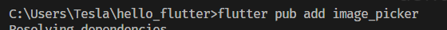
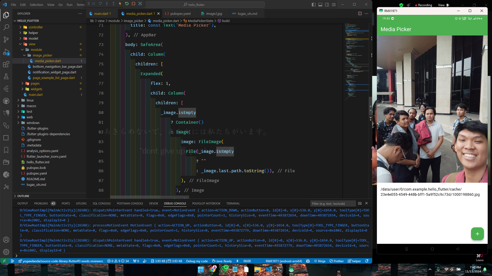

# Tugas 7 - Media Player

> Outline :
>
> * Image Picker
> * Video Player

Review :

Untuk membuat proyek siapkan dependencies

Image Picker

lalu buat stateful widget untuk kelas image picker

kenapa harus stateful?
Karena dengan stateful, terdapat fungsi yang tidak bisa diakses oleh stateless, yaitu adalah setState, dimana fungsi setState tadi itu digunakan untuk membuat sebuah perubahan state dari widget tanpa perlu melakukan restart aplikasi secara manual atau menjadikannya alternatif.

Floating Button, digunakan untuk memudahkan memilih pilihannya.

Buka Floating Button dan akan muncul pilihan seperti ini

Hasil akhir untuk pick image yang ada di galeri

---
